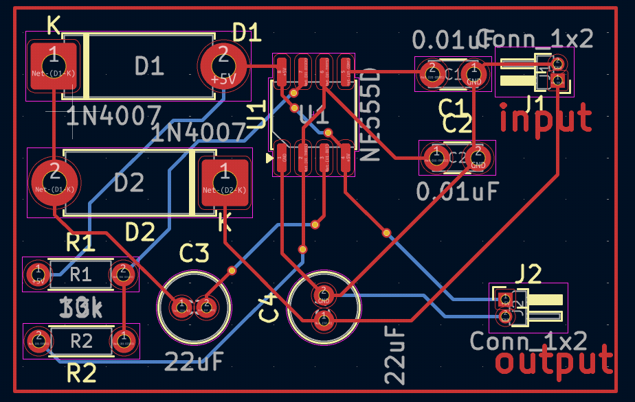
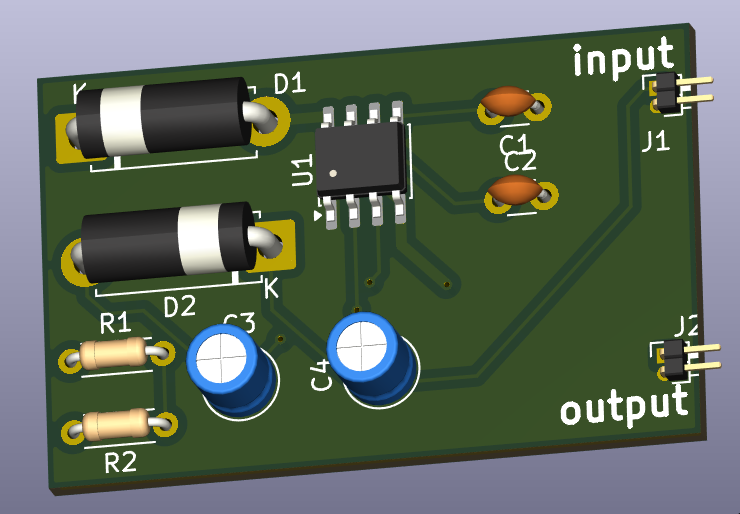
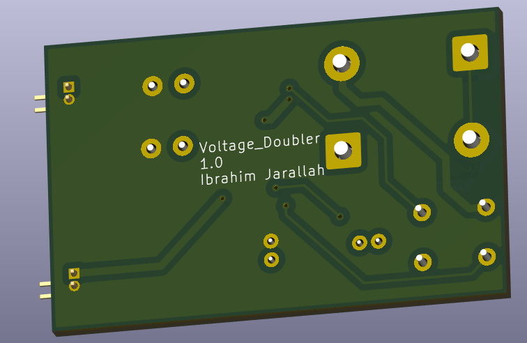

# Voltage Doubler — NE555 Based PCB

> A compact, single-supply voltage doubler circuit built around the NE555 timer IC.  
> Designed and laid out in **KiCad 9.0** — schematic + 2-layer PCB with full fabrication outputs.

---

## 📸 2D Views

| 2D Views |
|:---:|
|  |

---

## 📸 3D Views

| Front | Back |
|:---:|:---:|
|  |  |

---

## ⚡ Specifications

| Parameter         | Value                        |
|-------------------|------------------------------|
| Input Voltage     | 5V DC                        |
| Output Voltage    | ~8.6V DC (no load)           |
| Topology          | Villard Cascade (diode-cap)  |
| Oscillator        | NE555 astable mode           |
| Oscillation Freq  | ~600 Hz                      |
| Output Ripple     | Dependent on load current    |
| PCB Layers        | 2                            |
| Designed With     | KiCad 9.0.7                  |

> **Note:** Output voltage sags under load due to 22µF storage capacitors and NE555 drive limitations.  
> Suitable for light-load, low-current applications.

---

## 🔧 How It Works

The **NE555** is configured in **astable (free-running) mode**, generating a ~600 Hz square wave set by:

- **R1** (10kΩ) and **R2** (33kΩ) — timing resistors
- **C1/C2** (10nF) — timing capacitors

This switching signal drives a **Villard cascade** charge pump:

1. On the rising edge, **C3** (22µF) charges through **D1** (1N4007)
2. On the falling edge, **C4** (22µF) charges to the sum of Vin + Vc3 through **D2** (1N4007)
3. Result: output voltage ≈ **2 × Vin − 2 × Vf** ≈ **8.6V** (where Vf ≈ 0.7V per diode)

---

## 📦 Bill of Materials

| ID | Designator | Description | Quantity | Footprint |
|----|------------|-------------|----------|-----------|
| 1 | U1 | NE555D Timer IC | 1 | SO-8 3.9×4.9mm P1.27mm |
| 2 | R1 | Resistor 10.0kΩ | 1 | Axial DIN0204 L3.6mm P5.08mm |
| 3 | R2 | Resistor 33.0kΩ | 1 | Axial DIN0204 L3.6mm P5.08mm |
| 4 | D1, D2 | Diode 1N4007 | 2 | D 5W P10.16mm Horizontal |
| 5 | C1, C2 | Capacitor 10nF (ceramic) | 2 | Disc D3.0mm W1.6mm P2.50mm |
| 6 | C3, C4 | Capacitor 22µF (electrolytic) | 2 | Radial D4.0mm H5.0mm P1.50mm |
| 7 | J1, J2 | 1×2 Pin Header connector | 2 | PinHeader 1×2 P1.00mm Horizontal |

---

## 📁 Repository Structure

```
Voltage_Doubler/
├── Voltage_Doubler.kicad_pro     # KiCad project file
├── Voltage_Doubler.kicad_sch     # Schematic
├── Voltage_Doubler.kicad_pcb     # PCB layout
├── Voltage_Doubler.kicad_dru     # Design rules
├── Voltage_Doubler.net           # Netlist
├── BOM/
│   └── Voltage_Doubler.csv       # Bill of materials
├── gerbers/                      # Fabrication Gerber files
│   ├── Voltage_Doubler-F_Cu.gbr
│   ├── Voltage_Doubler-B_Cu.gbr
│   ├── Voltage_Doubler-F_Mask.gbr
│   ├── Voltage_Doubler-B_Mask.gbr
│   ├── Voltage_Doubler-F_Silkscreen.gbr
│   ├── Voltage_Doubler-B_Silkscreen.gbr
│   ├── Voltage_Doubler-F_Paste.gbr
│   ├── Voltage_Doubler-B_Paste.gbr
│   ├── Voltage_Doubler-Edge_Cuts.gbr
│   └── Voltage_Doubler-job.gbrjob
├── drills/
│   ├── Voltage_Doubler-PTH.drl   # Plated through-holes
│   └── Voltage_Doubler-NPTH.drl  # Non-plated through-holes
└── 3D_VIEW/
    ├── Voltage_Doubler_Front.png
    └── Voltage_Doubler_Back.png
```

---

## 🖥️ Opening the Project

1. Install [KiCad 9.0+](https://www.kicad.org/download/)
2. Clone this repository:
   ```bash
   git clone https://github.com/ibrahimjarallah/Voltage_Doubler.git
   ```
3. Open `Voltage_Doubler.kicad_pro` in KiCad

---

## 🏭 Fabrication

All fabrication outputs are ready in the `gerbers/` and `drills/` folders.  
Compatible with standard PCB manufacturers (JLCPCB, PCBWay, OSHPark, etc.).

- Load `Voltage_Doubler-job.gbrjob` directly into any Gerber viewer or fab upload portal
- Drill files: `PTH` (plated) and `NPTH` (non-plated) provided separately

---

## 📄 License

This project is licensed under the **MIT License**.  
You are free to use, modify, and distribute it with attribution.

---

## 👤 Author

**Ibrahim Jarallah**  
GitHub: [ibrahimjarallah](https://github.com/ibrahimjarallah
LinkedIn: [ibrahimjarallah](https://www.linkedin.com/in/ibrahim-jarallah
